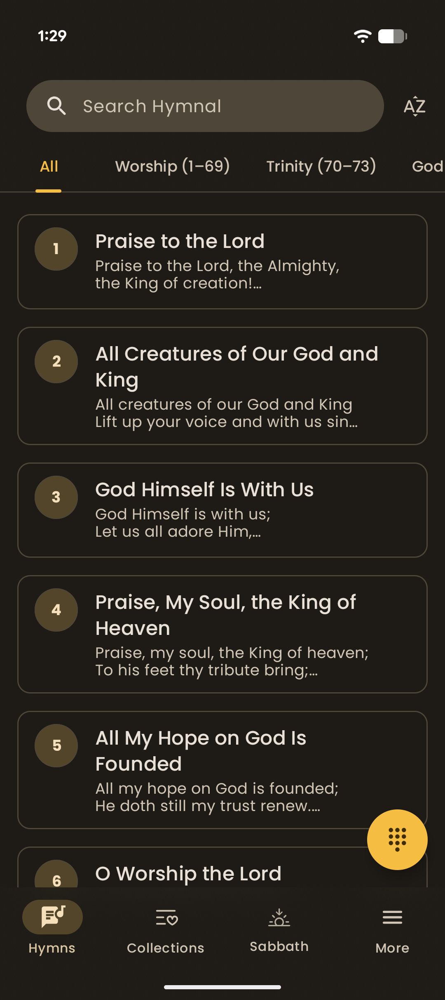
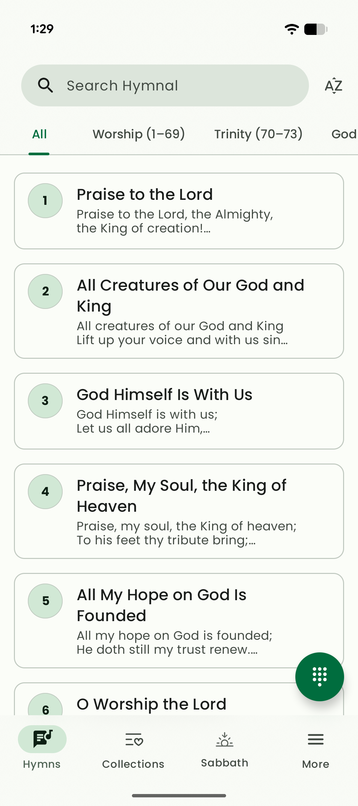
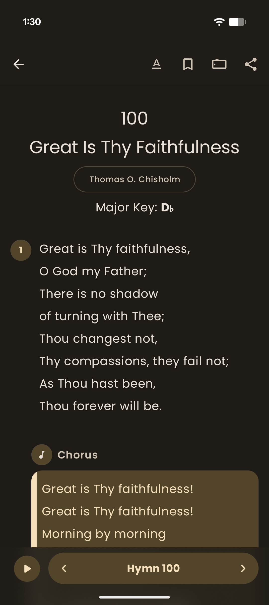
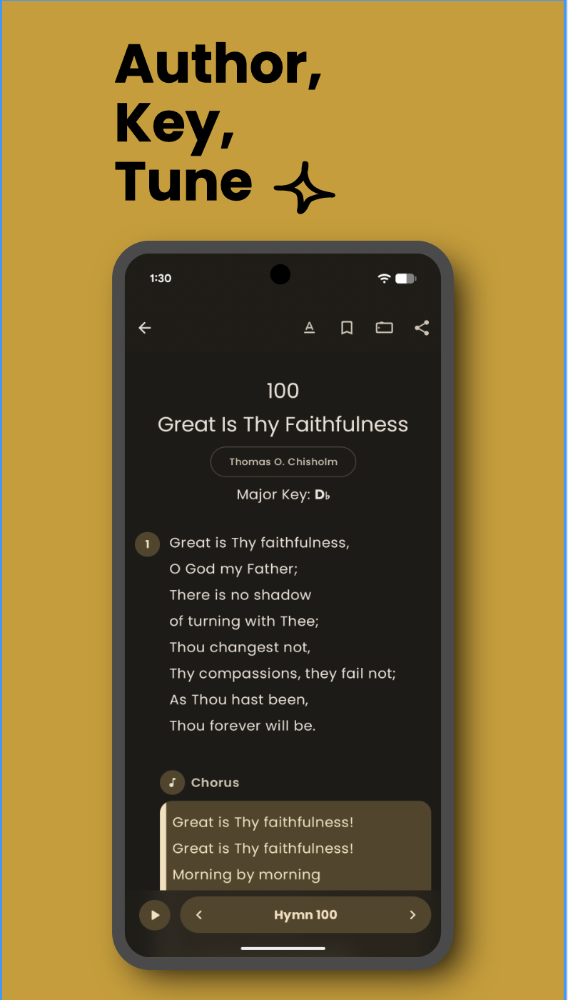

# SDA Hymnal

Carry the melodies of faith wherever you go. The SDA Hymnal App brings you the complete collection of standard hymns in a beautiful, distraction-free interface designed for worship, and personal devotion.

[](https://play.google.com/store/apps/details?id=com.tinashe.sdah)

## Screenshots

<p float="left">
  
  
  
  
</p>

## Getting Started

To get started with the project, follow these steps:

1.  **Clone the repository:**
    ```bash
    git clone https://github.com/TinasheMzondiwa/sda-hymnal-android.git
    ```
2.  **Open in Android Studio:**
    *   Launch Android Studio.
    *   Select "Open an existing Android Studio project".
    *   Navigate to the cloned directory and select it.
3.  **Build and Run:**
    *   Wait for Gradle sync to complete.
    *   Connect an Android device or start an emulator.
    *   Click the "Run" button (green play icon) to build and install the app.

## License

    Copyright 2025 Tinashe Mzondiwa

    Licensed under the Apache License, Version 2.0 (the "License");
    you may not use this file except in compliance with the License.
    You may obtain a copy of the License at

        http://www.apache.org/licenses/LICENSE-2.0

    Unless required by applicable law or agreed to in writing, software
    distributed under the License is distributed on an "AS IS" BASIS,
    WITHOUT WARRANTIES OR CONDITIONS OF ANY KIND, either express or implied.
    See the License for the specific language governing permissions and
    limitations under the License.
